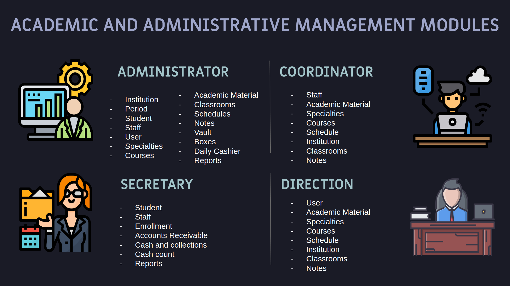
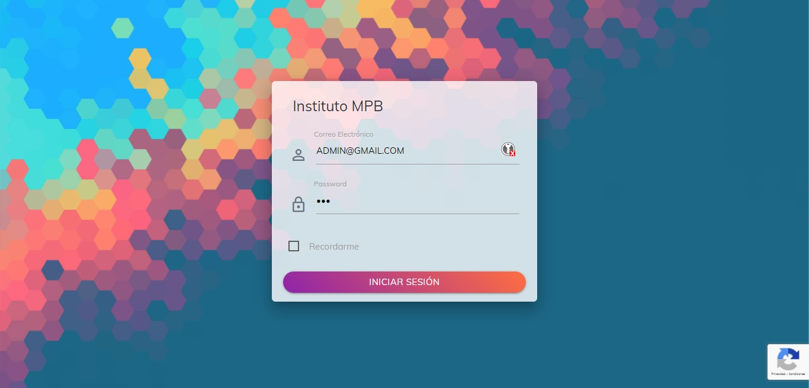
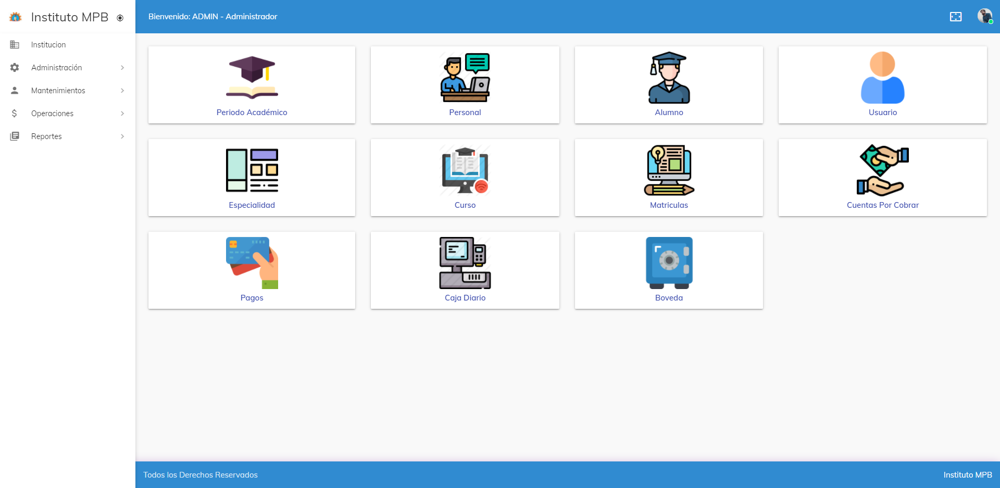
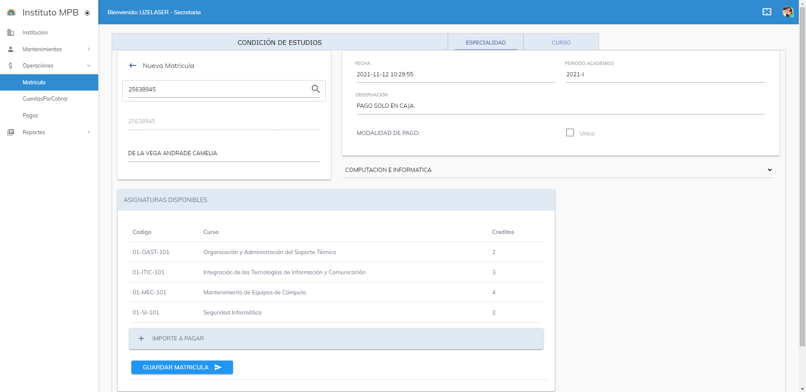
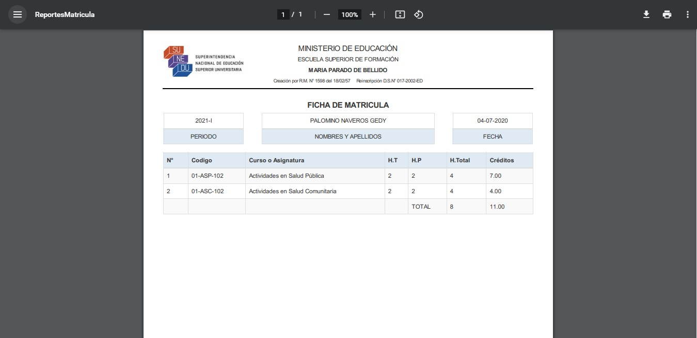
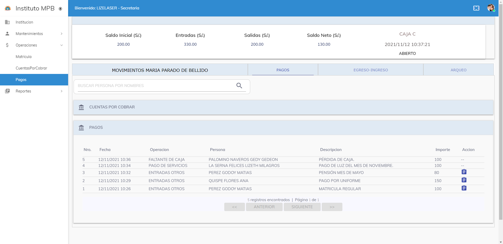
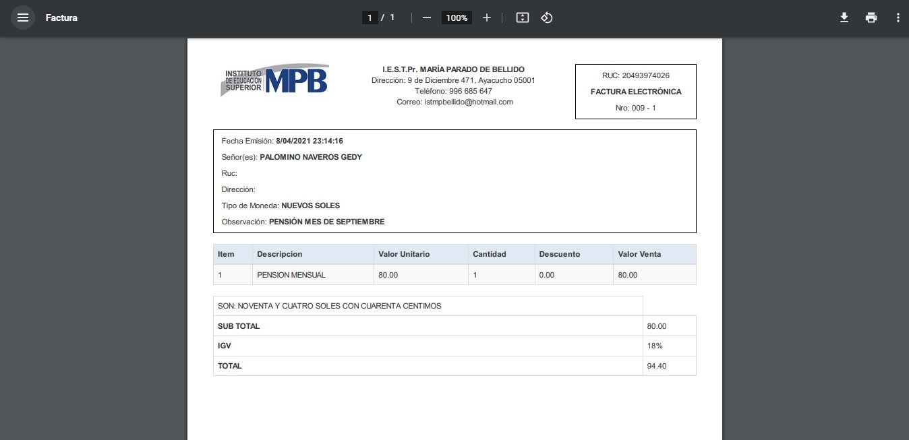

# Academic and administrative management system - MPB

## Table of Contents
* [General Info](#general-information)
* [Technologies Used](#technologies-used)
* [HTTP API](#http-api)
* [Interfaces](#interfaces)
* [Setup](#setup)
* [Usage](#usage)
* [Contribution](#contribution)
* [Project Status](#project-status)
* [Room for Improvement](#room-for-improvement)
* [Contact](#contact)


## General Information

### **Problem**
<p align="justify">Lack of implementation of information technologies that support the processes and activities of academic and administrative management at I.E.S.T.P "MARIA PARADO DE BELLIDO does not allow making timely decisions that lead to continuous improvement of the quality of service provided to students.</p>

### **Objectives**
<p align="justify">Develop and implement the Academic Administrative Management System MPB, which will provide control mechanisms and information management in order to improve and automate the academic and administrative processes at I.E.S.T.P "MARIA PARADO DE BELLIDO".</p>

- Facilitate the availability and control of access to academic and administrative resources.
- Automate processes related to enrollment, pensions, schedules, grades, academic resources, cash receipts and disbursements, payments and reports.
- Provide tools to administrative staff as a complement to their workflow.

### **Requirements**


| **N°** |    **User Story**          | **N°** |   **User Story**           |
| ------ | -------------------------- | ------ | -------------------------- |
|    1   |   Manage students          |   11   |   Cash Report
|    2   |   Manage staff             |   12   |   Manage specialties
|    3   |   Register enrollment      |   13   |   Manage courses
|    4   |   Generate enrollment form |   14   |   Register student grades
|    5   |   Assign Cashier           |   15   |   Manage academic period
|    6   |   Register payment         |   16   |   Manage schedules
|    7   |   Print payment voucher    |   17   |   Manage classrooms
|    8   |   Manage Vault             |   18   |   Manage roles
|    9   |   Cash count               |   19   |   Manage users
|    10  |   Close Cashier            |   20   |   Login


## Technologies Used

- ASP NET MVC - version 5.2.7
- Entity Framework - version 4.7.2
- Razor - version 3.2.7
- Bootstrap - version 3.4.1
- JQuery - version 3.3.1
- Xunit - version  2.4.1
- Sql Server - version 2019

## Features

### **Modules**


## HTTP API

According to the requirements, the api must contain the following end points.

#### **`Home`**

* `GET /`

#### **`Login`**

* `POST /login`

#### **`User`**

* `GET /user`
* `GET /user/:id`
* `POST /user`
* `PUT /user/:id`
* `DELETE /user/:id`

#### **`Role`**

* `GET /role`
* `GET /role/:id`
* `POST /role`
* `PUT /role/:id`
* `DELETE /role/:id`

#### **`Institution`**

* `GET /instituion`
* `GET /institution/:id`
* `POST /institution`
* `PUT /institution/:id`
* `DELETE /institution/:id`

#### **`Career`**

* `GET /career`
* `GET /career/:id`
* `POST /career`
* `PUT /career/:id`
* `DELETE /career/:id`

#### **`Test`**

* `GET /test`
* `GET /test/:id`
* `POST /test`
* `PUT /test/:id`
* `DELETE /test/:id`

#### **`Alternative`**

* `GET /alternative`
* `GET /alternative/:id`
* `POST /alternative`
* `PUT /alternative/:id`
* `DELETE /alternative/:id`

#### **`Result`**

* `GET /result`
* `GET /result/:id`
* `POST /result`

#### **`Recommendation`**

* `GET /recommendation`
* `GET /recommendation/:id`
* `POST /recommendation`

## Setup

### **Requirements**
* You must have [Entity Framework](https://dotnet.microsoft.com/download/dotnet-framework/net472) 4.7.2 or higher.
* You also must have [GIT](https://git-scm.com/) if you want to contribute to the project.

### **Get the repository locally**
First of all, clone the repository:

```bash
git clone https://github.com/lizelaser/MPB.git
cd <path_to_project>
```

## Usage

Start a development server with IIS Express for development and launch the project on localhost:55756


## Contribution
To contribute to MPB, follow these steps:

1. Fork this repository.
2. Create a branch: `git checkout -b <branch_name>`.
3. Make your changes and commit them: `git commit -m '<commit_message>'`
4. Push to the original branch: `git push origin <project_name>/<location>`
5. Create the pull request.

Alternatively see the GitHub documentation on [creating a pull request](https://help.github.com/en/github/collaborating-with-issues-and-pull-requests/creating-a-pull-request).


## Interfaces

### **Login**


### **Home**


### **Enrollment**


### **Print enrollment**


### **Payment**


### **Print payment**



## Project Status

[](https://www.repostatus.org/#inactive)


## Room for Improvement

Room for improvement:
- Publish the project in a cloud environment.
- Support the project on other operating systems using net core technology.

To do:
- Extend the web system by implementing a module for students, allowing them to manage their information, enroll and make payments directly in the system.
- Conduct comprehensive system planning to support the implementation of other processes such as attendance, grades and degrees, remote classes, assessments, library.


## Contact

Lizeth La Serna - [@lizelaser](https://github.com/lizelaser) - lizeth.lasernafelices@gmail.com

Project Link: [https://github.com/lizelaser/MPB](https://github.com/lizelaser/MPB.git)
